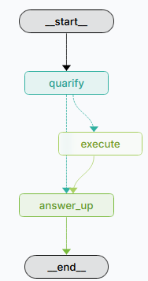

## Introduction
This project is an implementation of question answering sql rag in InfluxDB and langgraph.

## Graph


## Prerequisites
- Docker installed.
- An account in Langsmith.

## Models
- llama3.2
- llama3-groq-tool-use
- nomic-embed-text

## LLM Connection
- OLLAMA

## Memory
Currently, the project supports the following memory savers and switching them in `.env` file:
- MemorySaver
- PostgresSaver

## Development
1. Clone the repository.
2. Copy the `.env.example` to `.env` and update the values as per your environment. Some value would be available after up and running the docker containers.
3. Up the docker containers
   ```
   docker-compose up -d --build
   ```

***InfluxDB***
1. Run
   ```
   docker-compose exec -it influxdb3 bash
   ```
2. Create the token:
    ```
    influxdb3 create token --admin
    ```
3. Set `INFLUXDB3_AUTH_TOKEN`:
    ```
    export INFLUXDB3_AUTH_TOKEN=admin_token
    ```
4. Create the database:
    ```
    influxdb3 create database sensors
    ```
5. Write into the database:
    ```
    influxdb3 write --database sensors  --file /home/data/air-sensor-data.lp
    ```
    ```
    influxdb3 write --database sensors  --file /home/data/sensor-meta-data.lp
    ```
6. Verify:
    ```
    influxdb3 query --database=sensors "SHOW TABLES"
    ```
7. Delete if needed:
    ```
    influxdb3 delete table --database sensors air_sensors
    ```
   ```
    influxdb3 delete table --database sensors sensor_meta
    ```
Update the `.env` file with the token and database name.

***Ollama***
1. Run
   ```
   docker-compose exec -it ollama bash
   ```
2. Install models:
   ```
   ollama pull llama3.2
   ```
   ```
   ollama pull llama3-groq-tool-use
   ```
   ```
   ollama pull nomic-embed-text
   ```
3. Start the server:
   ```
   ollama serve
   ```

***Langgraph Studio***
1. Run
   ```
   docker-compose exec -it langgraph bash
   ```
2. Run
   ```
   langgraph dev --host 0.0.0.0 --port 2024
   ```
3. [Studio UI](https://smith.langchain.com/studio/?baseUrl=http://127.0.0.1:2024). On failure, browse to `Langgraph Platform > Langgraph Studio`.
4. [Langsmith UI](https://smith.langchain.com).

***CLI***
1. Run
   ```
   docker-compose exec -it langgraph bash
   ```
2. Run
   ```
   python rag.py
   ```
3. To end the chat type `exit` or `quit`.

**Frontend UI**
1. Adjust `views/.env`
2. Go to: `http://localhost:8501/` or replace `localhost` with the IP address of the machine.

## Testing
It is recommended to perform unit test before commiting the code. To run unit test, run the following command
```
pytest
```

## Type Checking and Linting
This repo uses `pre-commit` hooks to check type and linting before committing the code.

Install:
```
pip install pre-commit
```
Enable:
```
pre-commit install
```

## License
This project is licensed under the MIT License - see the [LICENSE](LICENSE) file for details.
